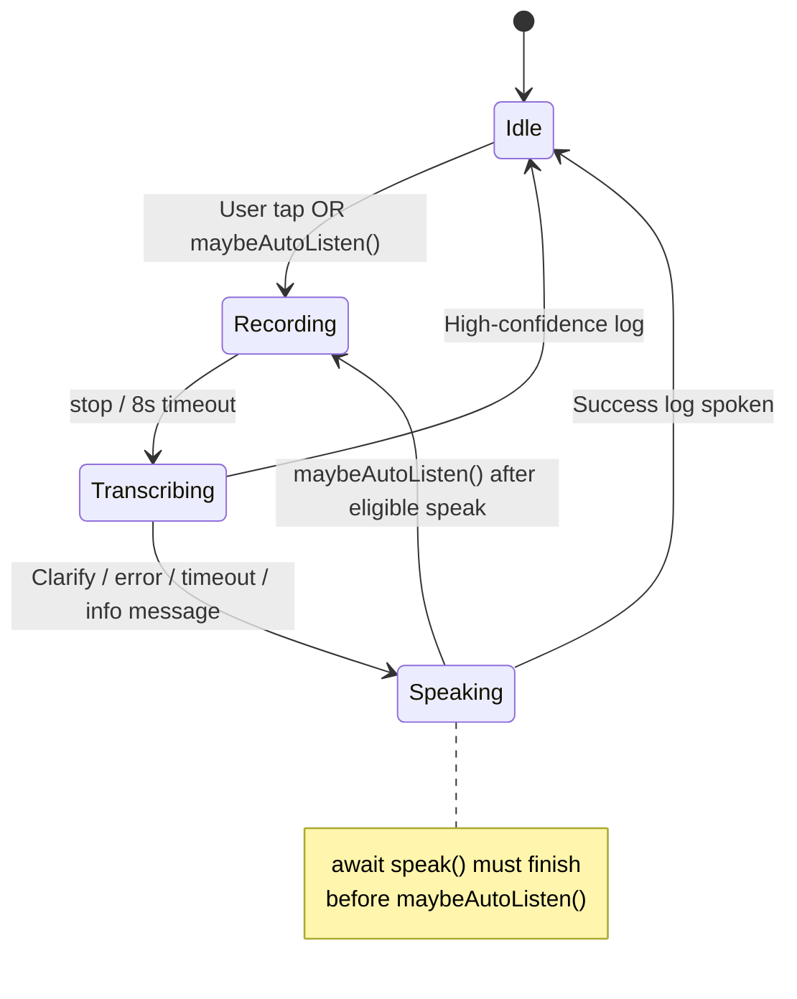
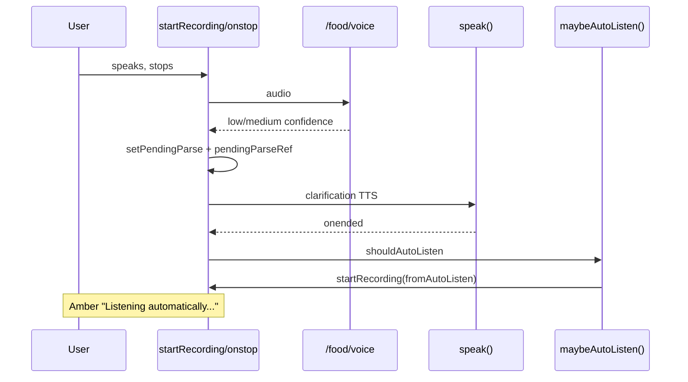
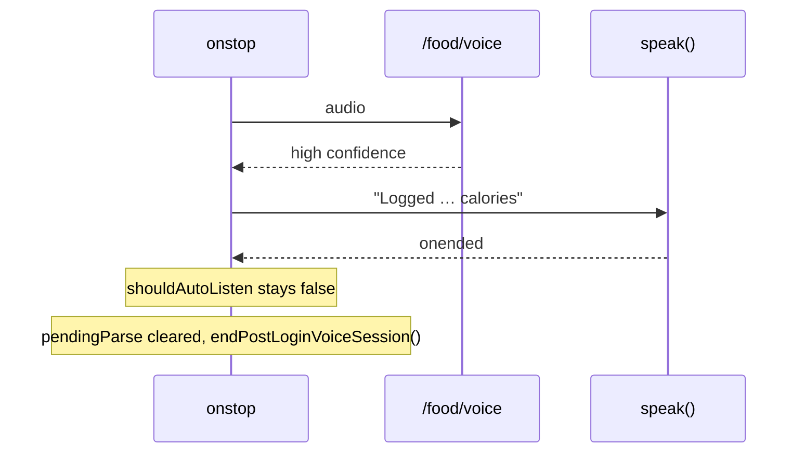
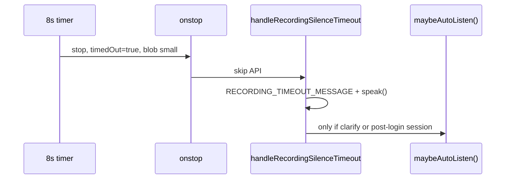

# Voice UX flow — developer guide

Primary implementation: `frontend/pages/index.tsx`  
TTS helper: `frontend/lib/speak.ts` (`speak()` is awaitable; resolves when playback ends)

This doc explains how to trace Speak-mode voice, auto-listen, clarification, and timeout behavior without reading the whole page component linearly.

---

## Foundational principles

| Mode | Rule |
|------|------|
| **Speak** | AI drives the session; user should only need **mute** (no taps for mic after prompts when auto-listen is on). |
| **See** | User drives with UI; **no unsolicited audio** except when they explicitly tap the mic. |
| **Timeouts** | Must resolve through **voice** (and auto-listen when enabled)—no required tap after silence. |
| **Clarifications** | One follow-up at a time; never a dead-end list without a voice path forward. |

---

## localStorage keys (hamburger menu)

| Key | Default | Purpose |
|-----|---------|---------|
| `speak2me_summary_on_open` | off | Speak daily summary after load (Speak mode only). |
| `speak2me_auto_listen` | off | Re-open mic after eligible prompts (see below). |
| `speak2me_greet` | on | Greet on open (Speak mode only). |
| `speak2me_mode` | `see` | Last See/Speak choice; restores header toggle on mount. |

Prefs hydrate in a mount `useEffect` before `setMounted(true)` so the first paint matches stored values.

---

## Symbols to grep (the map)

```bash
rg "maybeAutoListen|pendingParseRef|postLoginVoiceSession|handleRecordingSilence|shouldAutoListen|endPostLoginVoiceSession|RECORDING_TIMEOUT" frontend/pages/index.tsx
```

| Symbol | Role |
|--------|------|
| `maybeAutoListen()` | **Single gate** for opening the mic without a tap. |
| `pendingParse` / `pendingParseRef` | Waiting for user to answer a clarification. |
| `postLoginVoiceSessionRef` | After greet/summary on open, until first successful log. |
| `shouldAutoListen` | Local flag: “after this `speak()`, call `maybeAutoListen()`.” |
| `wasAwaitingClarification` | Snapshot at start of `onstop`: was `pendingParse` set when recording began? |
| `handleRecordingSilenceTimeout()` | 8s silence → timeout TTS (not API error path). |
| `recordingTimedOutRef` + `MIN_RECORDING_BYTES` | Detect timer stop with empty/near-empty audio. |
| `autoListening` | UI: amber pulse on main Speak button when mic opened via auto-listen. |
| `endPostLoginVoiceSession()` | Clears post-login auto-listen window after successful log. |

---

## Why `pendingParseRef` exists

React state (`pendingParse`) updates **asynchronously**. In the same async function you often do:

```ts
setPendingParse(pending);
await speak(msg);
await maybeAutoListen(); // pendingParse state may still be null here
```

`pendingParseRef` is updated **immediately** when setting pending parse, and kept in sync via:

```ts
useEffect(() => {
  pendingParseRef.current = pendingParse;
}, [pendingParse]);
```

Use the **ref** inside `maybeAutoListen()`, `recorder.onstop`, and anywhere you need the current “awaiting clarification?” value in async/recorder callbacks.

---

## `maybeAutoListen()` — when the mic re-opens

All paths go through this function. It runs only if **every** guard passes:

1. `speak2me_auto_listen` is on  
2. `mode === "speak"`  
3. Not `muted`  
4. Not `loading` or `recording`  

Then it requires **at least one** session flag:

- `pendingParseRef.current !== null` → waiting for clarification, **or**
- `postLoginVoiceSessionRef.current === true` → post-login voice window (until first successful log)

If both are false → **idle** (no mic).

`startRecording({ fromAutoListen: true })` sets `autoListening` for the amber UI indicator.

---

## Scenario trace table

| User scenario | Start / trigger | Speaks? | Auto-listen after? |
|---------------|-----------------|---------|---------------------|
| App open, greet/summary (Speak, toggles on) | On-load `useEffect` | Greet and/or summary | Yes, if auto-listen on → sets `postLoginVoiceSessionRef` |
| App open, See mode | On-load `useEffect` | No unsolicited audio | No |
| Voice log, high confidence | `startRecording` → `onstop` → API | “Logged … calories” | **No** — clears `pendingParse`, `endPostLoginVoiceSession()` |
| Voice log, needs clarify | `onstop` → set `pendingParse` | Clarify question | Yes, if `shouldAutoListen` |
| Voice log, API `data.error` (first try) | `onstop` | “Couldn't understand…” | **No** (`wasAwaitingClarification` was false) |
| Voice log, API error during clarify | `onstop` | Error message | Yes, if was already awaiting clarification |
| Voice log, intent reply only (`message`, no `parsed`) | `onstop` | e.g. calories today | **No** |
| 8s silence, tiny blob | Timer → `onstop` | “I didn't hear anything…” | Only if clarify or post-login session active |
| 8s silence, real audio | Timer → `onstop` | Normal API path | Per API outcome above |
| Network failure on voice API | `catch` in `onstop` | “Error processing audio…” | Only if `wasAwaitingClarification` |
| `submitText`, high confidence | `confirmLog` | Log confirmation | **No** |
| `submitText`, needs clarify | set `pendingParse`, speak | Clarify question | Yes |
| `submitText`, parse error | speak error | **No** |
| Successful `confirmLog` (any path) | `confirmLog` | Log confirmation | **No** — clears pending + post-login session |

---

## High-level state machine



---

## Sequence: clarification + auto-listen



---

## Sequence: successful log (no re-listen)



---

## Sequence: silence timeout (not error handler)



---

## `startRecording` / `onstop` outline

1. **Guards** — skip if already `recording` or `loading`.  
2. **Timeout** — `RECORDING_TIMEOUT_MS` (8s); sets `recordingTimedOutRef` before `stop()`.  
3. **onstop** —  
   - If `timedOut && blob.size < MIN_RECORDING_BYTES` → `handleRecordingSilenceTimeout()` → return.  
   - Else POST `/food/voice`.  
   - Branch on `error` / `message` / high confidence / clarify.  
   - `await speak(...)` where TTS matters.  
   - `finally`: `setLoading(false)`.  
   - If `shouldAutoListen` → `maybeAutoListen()`.

Important: `wasAwaitingClarification` is read **at the beginning of onstop** (before API), so it reflects whether we were already waiting for a clarify answer when this recording started.

---

## Code review checklist

When changing voice behavior, answer:

1. After `speak()` resolves, should the mic open?  
2. Is `pendingParse` / `pendingParseRef` set **before** that decision?  
3. Is this a **successful log** (→ idle) or still **waiting** (clarify / post-login)?  
4. Is this **silence timeout** or a real **API/network error**?  
5. Does See mode avoid unsolicited `speak()` / auto-listen?

---

## Debugging tips

Temporary logging at boundaries (remove before merge or guard with dev flag):

```ts
console.debug("[voice]", {
  step: "maybeAutoListen",
  autoListen,
  mode,
  pending: pendingParseRef.current,
  postLogin: postLoginVoiceSessionRef.current,
});
```

Manual test matrix:

- Auto-listen **on**, Speak mode, low-confidence voice → clarify → mic reopens (amber).  
- Auto-listen **on**, high-confidence voice → “Logged …” → mic stays closed.  
- Auto-listen **on**, post-login greet → mic opens; stay silent 8s → timeout phrase → mic may reopen.  
- Auto-listen **off** → never opens mic without tap.  
- Muted → never auto-opens.  
- See mode on load → no greet audio.

---

## Planned refactors (optional)

If `index.tsx` keeps growing, extract:

| Module | Contents |
|--------|----------|
| `hooks/useVoiceRecording.ts` | `startRecording`, timeout, `onstop`, silence handler |
| `hooks/useVoiceSession.ts` | refs, `maybeAutoListen`, post-login session |
| `lib/voiceMessages.ts` | `GREET_ON_OPEN_MESSAGE`, `RECORDING_TIMEOUT_MESSAGE`, etc. |

Until then, this doc + the grep symbols above are the intended navigation aids.

---

## Voice UX segments (implementation status)

| Segment | Topic | Status |
|---------|--------|--------|
| 1 | Hamburger menu, prefs, How it works | Done |
| 2 | Auto-listen after speaking | Done (refined: clarify + post-login only; no re-listen after success) |
| 3+ | See project Voice UX instructions | TBD |

Update this table as new segments land.
